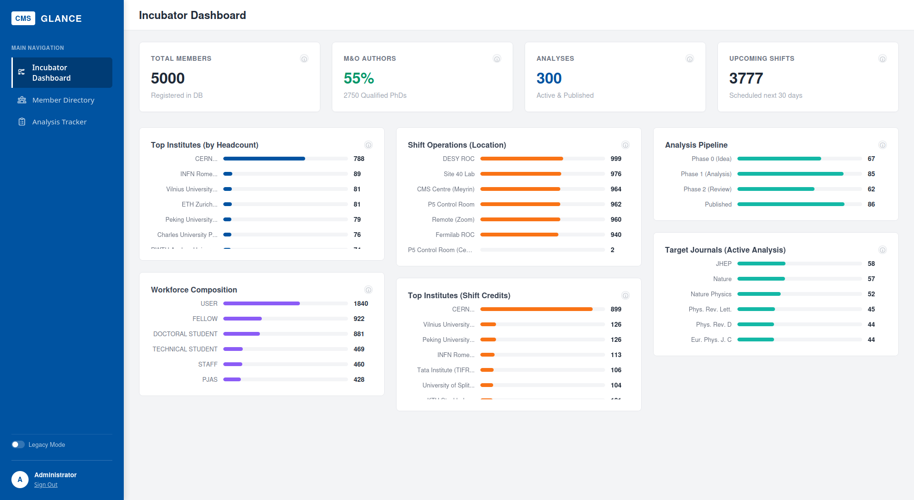
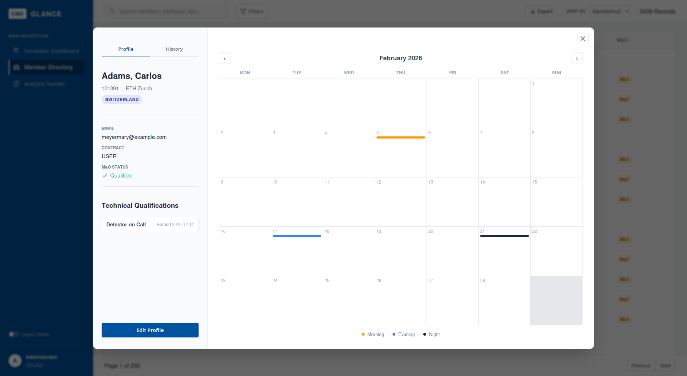

# GLANCE - CMS Incubator Management System


**Live Demo:** [https://smcmahon-cms-glance-demo.com](https://smcmahon-cms-glance-demo.com)  
*(Login: `cern` / `cms123`)*

## Overview
GLANCE is a full-stack incubator dashboard designed to streamline personnel and analysis management for the **CMS Experiment at CERN**. 

It solves the administrative challenge of tracking over **5,000+ members**, their M&O (Maintenance & Operations) qualifications, shift duties, and the lifecycle of scientific papers from "Draft" to "Published."

## Key Features
- **Incubator Dashboard:** Real-time KPIs visualizing workforce composition, shift coverage, and publication throughput.
- **Member Directory:** High-performance searchable directory of 5,000+ physicists with filtering by institute, country, and contract type.
- **Analysis Lifecycle Tracker:** Kanban-style tracking of scientific papers through the 4-stage CMS approval process.
- **Shift Management:** Interactive calendar for scheduling and auditing control room shifts (P5, Meyrin, Remote).
- **Role-Based Access:** JWT-authenticated admin access for modifying records and assigning shifts.
- **Legacy Mode:** A toggleable UI theme that mimics old Java Swing applications (a nod to CERN's legacy software).

## Tech Stack
* **Frontend:** Vue.js 3 (Composition API), Vite, Chart.js, CSS3.
* **Backend:** Django 5, Django REST Framework (DRF), SQLite (Demo) / PostgreSQL (Prod).
* **Infrastructure:** Docker, Docker Compose, Nginx (Reverse Proxy).
* **Deployment:** AWS EC2 (Ubuntu), Route 53 DNS, SSL/TLS via Let's Encrypt (Certbot).

## Architecture
The application follows a containerized microservices architecture:
1.  **Nginx (Host):** Handles SSL termination and forwards traffic to the internal Docker network.
2.  **Frontend Container:** Serves the built Vue.js static files via an internal Nginx instance.
3.  **Backend Container:** Runs the Django API via Gunicorn.
4.  **Database:** SQLite (Demo) / Ready for PostgreSQL (Production).

## Local Installation

**Prerequisites:** Docker & Docker Compose.

```bash
# 1. Clone the repository
git clone [https://github.com/yourusername/glance-cern-incubator.git](https://github.com/yourusername/glance-cern-incubator.git)
cd glance-cern-incubator

# 2. Build and run containers
docker compose up --build

# 3. Seed the database (Populates 5,000 mock members)
docker compose exec backend python manage.py migrate
docker compose exec backend python manage.py seed_glance
```

Access the app locally at http://localhost:8080.

## Testing

The project implements a dual-layer testing strategy to ensure reliability across the stack:

### Frontend Unit Tests (Vitest)

Validates component logic and system integrity using the **Vitest** runner.
```bash
cd frontend
npm run test:unit
```

### Backend Integration Tests (Django)

Uses Django's native test runner to validate API endpoints, database models, and authentication logic.
```Bash
docker compose exec backend python manage.py test
```

## Deployment (AWS)

This project is deployed on an AWS EC2 t3.micro instance.

- OS: Ubuntu 24.04 LTS

- Security: HTTPS enforced via Certbot & Nginx Reverse Proxy.

- Optimization: Configured with Swap memory to handle build processes on low-resource infrastructure.

## Gallery

<div align="center">
  
  <p><em>The Main Dashboard: Real-time KPIs and workforce composition</em></p>
  
  <br>

  
  <p><em>Shift Management: Interactive calendar for assigning Control Room duties</em></p>
</div>

---

